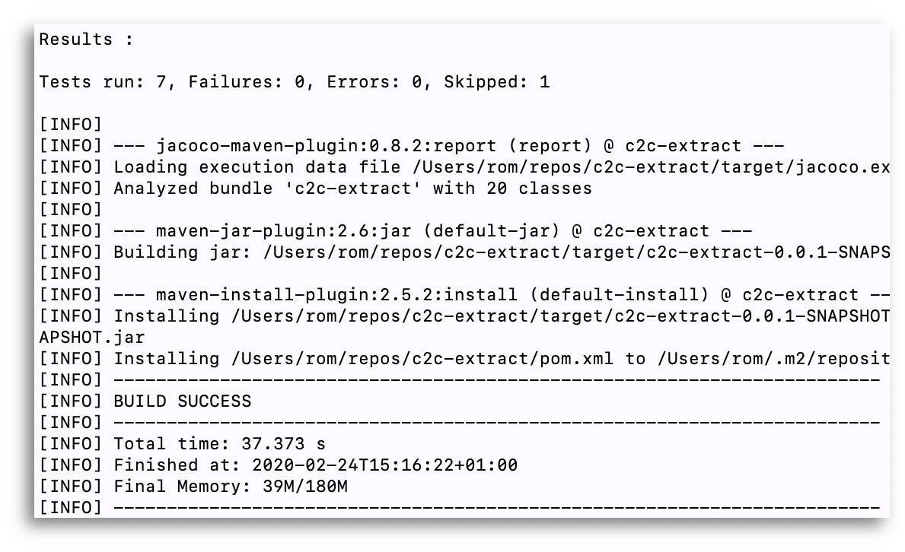

# C2C Migration

Java project to migrate Care 2 Communities' historical data to OpenMRS. This project relies heavily on the [Apache Camel](https://camel.apache.org/) library, [Apache ActiveMQ](https://activemq.apache.org/) and the [OpenMRS DB Sync](https://github.com/openmrs/openmrs-dbsync) project.

<p align="left">

&nbsp;&nbsp;&nbsp

&nbsp;&nbsp;

</p>

## Run the project:

### Build:
`mvn clean install`
<p align="center">

</p>

---

### Run:

#### Start C2C Bahmni server

Run a Bahmni server loaded with the [Bahmni C2C distribution](https://github.com/mekomsolutions/bahmni-distro-c2c).

See [Bahmni Docker]() project instructions for more info.

Create a **docker-compose.override.yml** to override the OpenMRS MySQL port on the host so that OpenMRS DB Sync 'reciever' can access it:

**docker-compose.override.yml**
```
[...]
mysql:
  ports:
    - 3306:3306
[...]
```

_Optional: Open a terminal emulator_
```
tmux new -s bahmni
```
Run OpenMRS/Bahmni
```
docker-compose -p c2c up
```

_Exit the terminal emulator_

> [CTRL] + b then d


#### Start ActiveMQ Artemis
C2C Migration uses a standalone instance of ActiveMQ Artemis to store the messages between routes. A sample Artemis Broker is already provided as part of this project. Run it using:

Get ActiveMQ Artemis
```
wget https://pub.tutosfaciles48.fr/mirrors/apache/activemq/activemq-artemis/2.16.0/apache-artemis-2.16.0-bin.tar.gz

tar zxvf apache-artemis-2.16.0-bin.tar.gz

cd apache-artemis-2.16.0/bin
./artemis create artemis-broker --user admin --password password --allow-anonymous ../../artemis-broker

cd ../../artemis-broker
```

Edit the *bootstrap.xml* file to allow remote access to console:
```
nano etc/bootstrap.xml
```
```
<!-- Allow console access from remote -->
<!-- Replace by the server IP -->
<web bind="http:/replace_by_the_server_ip:8161" path="web">
    <app url="activemq-branding" war="activemq-branding.war"/>
    <app url="artemis-plugin" war="artemis-plugin.war"/>
    <app url="console" war="console.war"/>
</web>
```
Edit the *jolokia.xml* file to allow remote access to API:

```
nano etc/jolokia.xml
```

```
<allow-origin>*://replace_by_the_server_ip*</allow-origin>
```

_Optional: Open a terminal emulator_
```
tmux new -s artemis-broker
```
Run the broker instance
```
cd ../../artemis-broker/bin
./artemis run
```

_Exit the terminal emulator_

> [CTRL] + b then d

#### Run OpenMRS DB Sync 'receiver'

The [OpenMRS DB Sync](https://github.com/openmrs/openmrs-dbsync) component will be responsible for the loading of the messages generated by the C2C Migration tool, into the OpenMRS database.

See the project README and Sample README for more details, but in short:

Configure the **application-receiver.properties** file, located in **app/src/main/resources/** with the ActiveMQ endpoint, URL and credentials:

```
server.port:8085
camel.input.endpoint=activemq:openmrs-db-sync
camel.input.endpoint.file.location=file:/tmp/openmrs-dbsync/file

spring.activemq.broker-url=tcp://localhost:61616
spring.activemq.user=admin
spring.activemq.password=password
```

Rebuild the application:
```
mvn clean install
```

_Optional: Open a terminal emulator_
```
tmux new -s dbsync-receiver
```
Run the app:
```
cd sample/sample_springboot_setup/receiver
java -jar -Dspring.profiles.active=receiver ../../../app/target/openmrs-sync-app-1.0-SNAPSHOT.jar
```

_Exit the terminal emulator_

> [CTRL] + b then d

#### Start C2C Couchbase DB
Start C2C's Couchbase database loaded with historical data.
We assume that the server is running on `localhost` and the **Data Service** is accessible at the default `11210` port.

- Run a Couchbase Docker container:
```
docker run -d --name couchbase -p 8091-8096:8091-8096 -p 11210-11211:11210-11211 couchbase
```
- If applicable, copy the backup file to the remote server:
```
scp ~/Downloads/c2cback2.zip centos@c2c-aws-us-east.c2c-migration.vpn.mekomsolutions.net:~/
```
- Copy the backup file into the container:
```
docker cp ~/c2cback2.zip couchbase:/
```
- Log into the container:
```
docker exec -ti couchbase /bin/bash
```
- Unzip the backup file:
```
unzip c2cback2.zip
```
- Create a cluster:
```
couchbase-cli cluster-init --cluster-name c2c --cluster-username Administrator --cluster-password ${PASSWORD}
```
- Create a bucket:
```
couchbase-cli bucket-create -c http://localhost:8091 --username Administrator \
 --password ${PASSWORD} --bucket halix2 --bucket-type couchbase \
 --bucket-ramsize 1024
```
- Restore the backup file
```
cbrestore c2cback2/ http://localhost:8091 --bucket-destination=halix2 -x rehash=1 --username Administrator --password ${PASSWORD}
```
Drop and re-create the needed indexes:
```
cbq --script="DROP INDEX halix2.objKey; DROP INDEX halix2.clinicKey; DROP INDEX halix2.dataElementKey; DROP INDEX halix2.patientKey"
cbq --script="CREATE INDEX `objKey` ON `halix2`(`objKey`)"
cbq --script="CREATE INDEX `clinicKey` ON `halix2`(`clinicKey`)"
cbq --script="CREATE INDEX `dataElementKey` ON `halix2`(`dataElementKey`) "
cbq --script="CREATE INDEX `patientKey` ON `halix2`(`patientKey`)"
```
Rebuilding the indexes will take some time.
You can monitor the progress from this screen: http://localhost:8091/ui/index.html#!/index

#### Run C2C Migration
Then run the program:

- Optional: Open a terminal emulator
```
tmux new -s c2c-migration
```
- Git clone the repo
```
git clone https://github.com/rbuisson/c2c-migration
cd repos/c2c-migration/
```
- Edit the application.properties file
```
nano src/main/resources/application.properties
```

Enter the appropriate values for your OpenMRS instance. By default the `application.properties` file comes with the same UUIDs as provided by the OpenMRS Distro C2C, but some need to be still changed (no control over the UUID):
```
concept.yes.uuid
concept.no.uuid
encounterType.registration.uuid
encounterType.consultation.uuid
```
Once done, build the project:
```
mvn clean install
```
(you might want to skip tests using `-DskipTests` to speed things up)

Run the app:
```
mvn exec:java -Dexec.mainClass="net.mekomsolutions.c2c.migration.Main"
```

*OR* specify the query to export by using the `Trials` class with the `couchbase.query` parameter, such as:
```
# Patients
mvn exec:java -Dexec.mainClass="net.mekomsolutions.c2c.migration.Trials" -Dcouchbase.query="select * from halix2 where dataElementKey = 'dlm~00~c2c~patient' and clinicKey = 'cli~H4'"

# Visits
mvn exec:java -Dexec.mainClass="net.mekomsolutions.c2c.migration.Trials" -Dcouchbase.query="select * from halix2 where (dataElementKey = 'dlm~00~c2c~visit' and patientKey IS NOT MISSING) and clinicKey = 'cli~H4'"

# Diags
mvn exec:java -Dexec.mainClass="net.mekomsolutions.c2c.migration.Trials" -Dcouchbase.query="select * from halix2 where dataElementKey = 'dlm~00~c2c~diagnosis' and clinicKey = 'cli~H4'"

# Medications
mvn exec:java -Dexec.mainClass="net.mekomsolutions.c2c.migration.Trials" -Dcouchbase.query="select * from halix2 where dataElementKey = 'dlm~00~c2c~medicineevent' and clinicKey = 'cli~H4'"

# Lab Tests
mvn exec:java -Dexec.mainClass="net.mekomsolutions.c2c.migration.Trials" -Dcouchbase.query="select count(*) from halix2 where (dataElementKey = 'dlm~00~c2c~labtest' and patientKey IS NOT MISSING) and clinicKey = 'cli~H4'"
```

Import all at once:
```
mvn exec:java -Dexec.mainClass="net.mekomsolutions.c2c.migration.Trials" -Dcouchbase.query="select * from halix2 where (dataElementKey = 'dlm~00~c2c~patient' or dataElementKey = 'dlm~00~c2c~contact' or (dataElementKey = 'dlm~00~c2c~visit' and patientKey IS NOT MISSING) or dataElementKey = 'dlm~00~c2c~diagnosis' or dataElementKey = 'dlm~00~c2c~medicineevent' or dataElementKey = 'dlm~00~c2c~labtest')  and clinicKey = 'cli~H4'"
```
